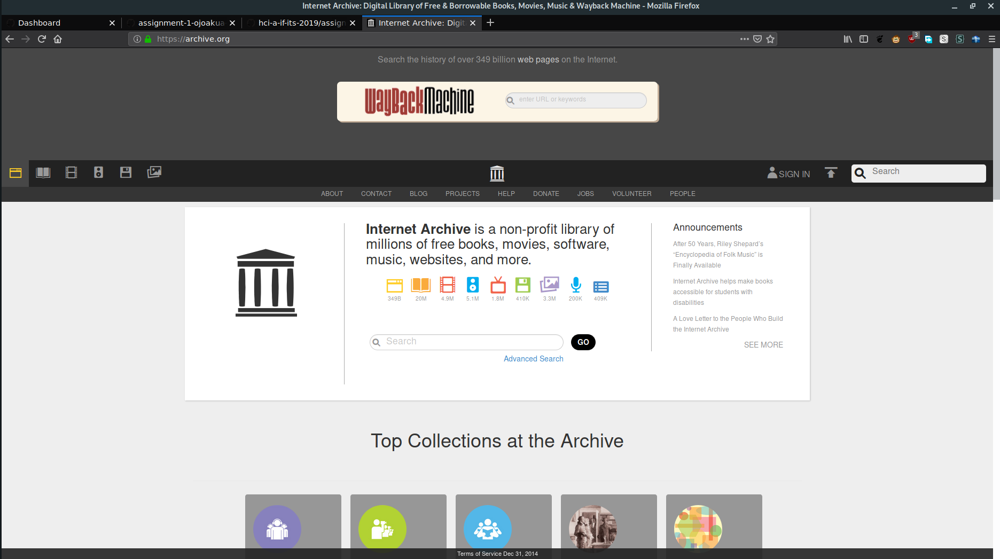
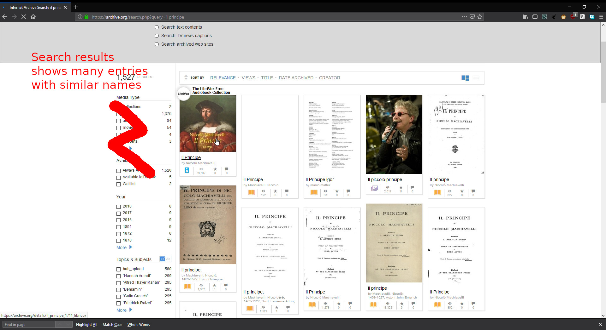
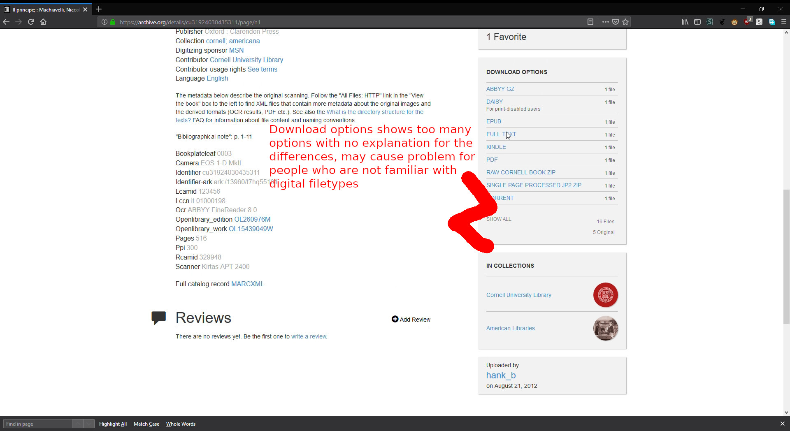
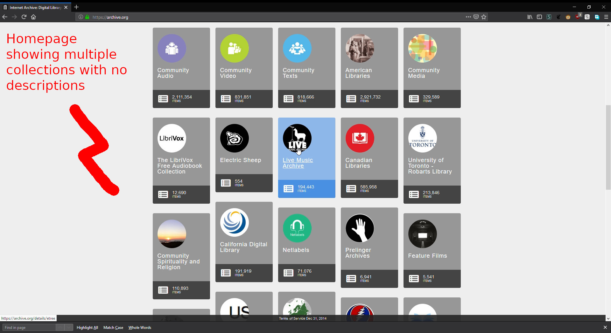
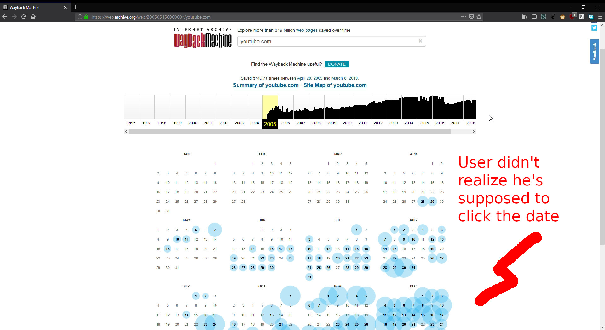

# Contextual Inquiry and Analysis
## Internet Archive Description



[Internet Archive](https://archive.org) is a digital library of Internet sites and other cultural artifacts in digital form. They began by archiving the Internet back in 1996, and then started providing digital versions of books and in late 2000, start archiving TV shows. Anyone with a free account can upload files to the site. 
## Instruction Script
    - Make a free account
    - Try searching for a book with the search box and downloads it
    - Try browsing for a book
    - Try accessing a site from specific year with the wayback machine
## User Description
User is a 1st year student from English Literature department in Universitas Sunan Ampel. Never used the site before. Mostly uses internet for social media and playing games.
## Transcript
```
Me: Coba bikin akun gratis
User: *isi form*
Situs: *gagal buat akun*
User: Usernamenya sudah dipake ternyata
User: Kok nggak ngasih tau dari awal kalo udah dipake
Me: Ya jeleknya berarti, nggak kayak situs sosmed kayak facebook twitter dkk.
*Sukses buat akun*
User: Sekarang ngapain?
Me: Coba cari buku "Il Principe" terus download, boleh pake search box
Situs: *keluar hasil*
User: Ini yang mana?
User: *klik satu entry*
Me: Bukan itu, kalo itu audiobook
User: Oh iya sih, filenya mp3
User: *kembali ke halaman hasil*
User: Yang ini ta? *klik satu entry*
User: Ini yang mana yang didownload? Ada banyak
Me: Yang pdf ae
User: *download pdf*
Me: Sekarang coba cari buku "Divine Comedy" nggak pake search box
User: Berarti harus buka satu-satu ini
User: Ada banyak ini, gimana nyarinya. American library aja ada banyak banget
Me: Yawes coba di California Digital Library
User: Banyak ini bim, masak cari satu-satu
Me: Ya carien
User: Susah ini, ada seratus ribu lebih lho
Me: Ya udah itu deh Tom Sawyer
User: *nemu Tom Sawyer*
Me: Sekarang coba buka YouTube dari tahun 2005
User: *ketik youtube.com ke search box*
Situs: *tampilkan halaman hasil*
User: *klik tahun 2005*
User: Kok isinya malah kalender
User: *ketik https://youtube.com ke search box*
Situs: *tampilkan halaman hasil*
User: *klik tombol summary of site*
User: Ini tulisannya web tapi malah keluar statistik
User: *kembali ke homepage*
User: Coba web random deh
User: *klik web random*
Situs: *nampilkan website*
User: *masukin youtube.com ke address bar*
User: Nah akhirnya muncul
User: Sekarang mana yang 2005
User: Nah ketemu
User: Begini ya youtube dulu wkwk
User: Udah gini aja?
Me: Ya udah, tks
```
## Models and Annotations
### Artifact Model
![Artifact Model and Annotation]




### Flow Model

### Cultural Model

## Do's and Don't's
Fusce lobortis massa mauris, in aliquam erat aliquet eget. Donec rhoncus venenatis mauris, at commodo odio bibendum ac. Sed consectetur enim justo, vitae maximus eros elementum non. Sed feugiat orci sem, vel faucibus sem aliquet sed. Praesent pulvinar felis eget nisl varius, id lacinia urna pretium. Sed at ornare diam, nec fringilla dolor. In ut gravida sapien, eget varius magna. Morbi lobortis ex eu eleifend finibus. Phasellus eget nulla ullamcorper, ullamcorper purus ac, luctus turpis. Sed volutpat mauris ut erat consectetur, in sagittis erat egestas.

# Remarks
> * This case was a good one. I saw you're able to expose the problem pretty well.
> * However, it's unfortunate that you could not complement the artificat model with the flow and cultural model as well.
> * The transcript is great. Its flow is quite natural, although in some parts you had to give explicit clues to the user. Nevertheless, the transcript lacks of line numbering or time-code.

| Working Days | Commits before D | Commits after D | Presentation (80%) | Repo (20%) | Total |
|:------------:|:----------------:|:---------------:|:------------------:|:----------:|:-----:|
| 1            | 1                | 3               | 55                 | 60         | 56    |
